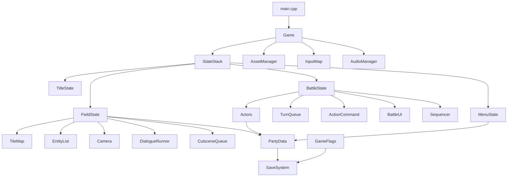

# Architecture

A living map of your own codebase. Update it the same day you add a system. When you come
back after a two-week break, this file is what saves you.

For each system, record: **what it owns**, **who it talks to**, and **the decision you
made and why**. That last part is the valuable one.

---

## Target shape

This is where the roadmap is heading. You will not have most of it for months.

Key ownership rule to aim for: **game data (party, inventory, flags) outlives states**.
A battle must not own the party, or the party dies when the battle ends.

---

## Decision log

Append only. Never delete an entry, even when you reverse it - add a new entry that says
you reversed it and why.

### D001 - raylib over SFML
**Date:** _(fill in)_
**Decision:** use raylib 6.0 as the multimedia layer.
**Why:** minimal abstraction means the architecture is visibly mine, not the library's.
Everything the game needs (sprites, tilemap rendering, input, audio, fonts, Camera2D,
shaders) is covered.
**Cost accepted:** no built-in UI, no built-in scene graph, no built-in ECS. Building
those is the point.

### D002 - _(your first real decision, around Day 40)_
**Date:**
**Decision:**
**Why:**
**Cost accepted:**

---

## System inventory

Fill a row in each day you finish a system.

| System | Files | Owns | Depends on | Day built |
| --- | --- | --- | --- | --- |
| | | | | |

---

## Invariants

Rules that must never be broken. Add to this list every time you fix a bug caused by
breaking an unwritten rule.

- Textures are loaded once by `AssetManager` and never unloaded mid-state.
- Update never draws; draw never mutates game state.
- No system calls raylib input functions directly except `InputMap`.
- _(add yours)_
